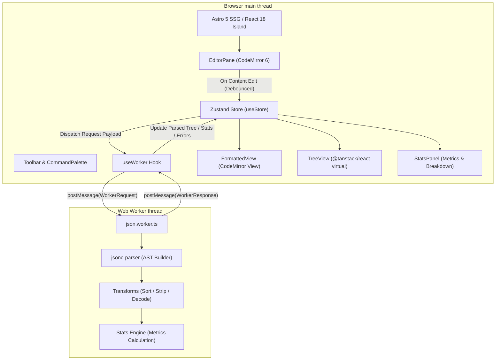

# JSON Formatter Pro — Software Design Document (DESIGN.md)

## Executive Summary

**JSON Formatter Pro** is a privacy-first, enterprise-grade web application engineered for zero-latency formatting, validation, beautification, minification, tree exploration, and statistical analysis of JSON data. 

Built on a zero-knowledge architecture, 100% of data processing occurs locally within the browser. The application leverages **Astro 5** for static site delivery, **React 18** for interactive UI components, **CodeMirror 6** for high-performance text editing, **jsonc-parser** for fault-tolerant AST parsing and line/column diagnostics, **Zustand** for state management, **Web Workers** for background CPU execution, and **@tanstack/react-virtual** for virtualized tree rendering.

---

## 1. Architectural Overview & Technology Rationale

### 1.1 Tech Stack Matrix

| Layer | Technology | Primary Purpose & Rationale |
| :--- | :--- | :--- |
| **Framework / SSG** | **Astro 5** | Static Site Generation (SSG) with Islands Architecture. Delivers static marketing/documentation routes (`/`, `/about`, `/faq`, `/privacy`) with zero client-side JS overhead, isolating client hydration strictly to interactive React islands. |
| **UI Library** | **React 18** | Powers the interactive client island (`FormatterApp`). Utilizes strict component isolation, hooks, and virtual DOM rendering. |
| **Code Editor** | **CodeMirror 6** | Extensible, modern code editor core. Replaces legacy textareas to deliver custom syntax highlighting, lint gutters, line numbering, diagnostic popups, and keyboard shortcuts. |
| **AST Parser** | **jsonc-parser** | Microsoft's high-performance JSON/JSONC scanner and parser. Generates exact AST nodes, precise character offset spans, and granular parse error codes. |
| **State Management** | **Zustand 5** | Unopinionated, lightweight state store. Handles UI state, format preferences, and localStorage persistence with payload size safeguards. |
| **Multi-threading** | **Web Worker** | Offloads AST parsing, serialization, minification, sorting, filtering, and statistical analysis off the main browser thread to prevent UI freezing. |
| **Tree Virtualization**| **@tanstack/react-virtual** | Renders 10,000+ node JSON trees smoothly by maintaining fixed O(visible) DOM nodes regardless of object depth or size. |
| **Styling & System** | **Tailwind CSS 3 + CSS Variables** | Utility-first styling engine coupled with semantic CSS custom properties for instant light/dark/system theme transitions without runtime stylesheet recalculations. |

---

## 2. High-Level System Architecture

The following diagram illustrates the flow of data between the user interface, Zustand state store, Web Worker thread, and visual output views.



---

## 3. Data Flow & Background Multithreading Protocol

### 3.1 Web Worker Message Protocol (`src/workers/protocol.ts`)

To ensure the UI main thread never stutters during large file processing (up to 50 MB), all compute-heavy operations are isolated in `src/workers/json.worker.ts`.

#### Worker Request Types
```typescript
export type WorkerRequest =
  | { id: number; kind: 'process'; raw: string; options: FormatOptions }
  | { id: number; kind: 'minify'; raw: string };
```

#### Worker Response Types
```typescript
export type WorkerResponse =
  | { id: number; kind: 'process'; ok: true; formatted: string; stats: JsonStats; value: JsonValue }
  | { id: number; kind: 'process'; ok: false; error: JsonError }
  | { id: number; kind: 'minify'; ok: true; minified: string }
  | { id: number; kind: 'minify'; ok: false; error: JsonError };
```

### 3.2 Async Out-of-Order Message Discarding

To resolve race conditions during rapid typing, each outgoing worker request is assigned an incremental integer `id` via `lastRequestId.current`. If a response arrives whose `id` does not match the active pending ID, the result is discarded immediately.

```
User types "a" -> Request #1 dispatched
User types "ab" -> Request #2 dispatched
Worker finishes #1 -> Main thread compares (#1 !== #2) -> DISCARD #1
Worker finishes #2 -> Main thread compares (#2 === #2) -> ACCEPT & RENDER #2
```

---

## 4. AST Parsing, Fault Diagnostics & Fix Suggestions

### 4.1 Tolerant Parsing Engine (`src/lib/json/parser.ts`)

Strict `JSON.parse` fails atomically without actionable offset context. `JSON Formatter Pro` utilizes `jsonc-parser` to construct an explicit AST node tree (`Node`) and map parser errors to exact character offsets.

### 4.2 Offset-to-Line/Column Translation

The `offsetToLineColumn` algorithm scans the source buffer character by character up to the error offset, correctly accounting for both UNIX (`\n`) and Windows (`\r\n`) line terminators:

```typescript
function offsetToLineColumn(source: string, offset: number): { line: number; column: number } {
  let line = 1, column = 1;
  const end = Math.min(offset, source.length);
  for (let i = 0; i < end; i++) {
    const ch = source.charCodeAt(i);
    if (ch === 10 /* \n */) {
      line++; column = 1;
    } else if (ch === 13 /* \r */) {
      if (source.charCodeAt(i + 1) === 10) i++;
      line++; column = 1;
    } else {
      column++;
    }
  }
  return { line, column };
}
```

### 4.3 Diagnostic Fix Suggestions (`src/lib/json/suggestions.ts`)

When standard syntax checks fail, a heuristic diagnostic engine inspects a 64-character window around the failure offset to output human-actionable error repair suggestions:

* **Trailing Commas**: Identifies `,}` or `,]` and recommends comma removal.
* **Single Quotes**: Detects `'key': 'value'` and prompts conversion to double quotes.
* **Unquoted Keys**: Matches `identifier:` and suggests double-quoting.
* **Invalid Keywords**: Identifies `undefined`, `NaN`, or `Infinity` and suggests `null` or valid numeric format.
* **Unescaped Control Characters**: Pinpoints raw tabs/newlines inside string literals.

---

## 5. UI Architecture & Component Hierarchy

### 5.1 Component Structure (`src/components/formatter/`)

```
FormatterApp (Root Controller)
├── Toolbar (Actions, Toggles, Indentation, Upload/Download/Copy)
├── Main Grid (Split View Layout)
│   ├── Input Section
│   │   └── EditorPane (CodeMirror 6 Instance + Error Diagnostics Gutter)
│   └── Output Section
│       └── OutputPanel (Tab Navigation: Formatted | Tree | Stats)
│           ├── FormattedView (Read-Only CodeMirror View)
│           ├── TreeView (Virtualized Hierarchical Inspector)
│           └── StatsPanel (Structural Metrics & Payload Analysis)
├── StatusBar (Line/Col Count, Byte Metrics, Health Status, Theme Switcher)
├── CommandPalette (Cmd+K Accessible Modal Search Interface)
├── HelpSheet (Keyboard Shortcuts Guide)
└── Toaster (Accessible Feedback Notifications)
```

---

## 6. Tree Virtualization Engine (`src/components/formatter/TreeView.tsx`)

Rendering large JSON structures into traditional nested DOM elements (`<div><ul><li>...`) leads to DOM memory explosion and heavy layout thrashing. 

### 6.1 Depth-First Flattening Algorithm

`TreeView` flattens the visible nodes of the JSON tree into a single 1-dimensional array (`FlatRow[]`), taking into account the currently expanded path set (`Set<string>`):

```typescript
interface FlatRow {
  id: string;
  depth: number;
  key: string | number | null;
  kind: 'object' | 'array' | 'string' | 'number' | 'boolean' | 'null';
  value: JsonValue;
  childrenCount: number;
  hasChildren: boolean;
  path: string;
}
```

### 6.2 Virtualized Windowing with TanStack Virtual

`@tanstack/react-virtual` computes the exact pixel height and translateY offset for only the rows within the viewport, executing tree expansion, collapse, and real-time query filtering in constant O(visible) space complexity.

---

## 7. State Architecture & Storage Safeguards

### 7.1 Zustand Store Architecture (`src/store/index.ts`)

State is centralized in a unified Zustand store. To safeguard against browser crashes caused by exceeding `localStorage` quotas (typically 5 MB), `partialize` gates input persistence:

```typescript
const MAX_PERSISTED_INPUT = 512 * 1024; // 512 KB Hard Limit for localStorage

export const useStore = create<State>()(
  persist(
    (set) => ({ /* store implementation */ }),
    {
      name: 'json-formatter-pro',
      storage: createJSONStorage(() => localStorage),
      partialize: (s) => ({
        input: s.input.length <= MAX_PERSISTED_INPUT ? s.input : '',
        options: s.options,
        theme: s.theme,
        mode: s.mode,
      }),
    }
  )
);
```

---

## 8. Design System & CSS Token Architecture

### 8.1 CSS Variables & Design System Tokens (`src/styles/tokens.css`)

The application enforces strict design tokens defined via CSS custom properties. Dual-theme support (`light`, `dark`, `auto`) operates by setting `data-theme="dark"` or `data-theme="light"` on the document root element.

```css
:root {
  --bg: #ffffff;
  --surface: #f8fafc;
  --muted: #f1f5f9;
  --border: #e2e8f0;
  --fg: #0f172a;
  --subtle: #64748b;
  --primary: #2563eb;
  --primary-hover: #1d4ed8;
}

[data-theme="dark"] {
  --bg: #0b0f19;
  --surface: #111827;
  --muted: #1f2937;
  --border: #374151;
  --fg: #f9fafb;
  --subtle: #9ca3af;
  --primary: #3b82f6;
  --primary-hover: #60a5fa;
}
```

---

## 9. Security, Privacy & Compliance Model

### 9.1 Privacy Guarantee
* **Zero Remote Processing**: All JSON data remains inside the user's browser runtime memory.
* **No Telemetry / Analytics**: No external tracking scripts, third-party analytics, or data logging.

### 9.2 Content Security Policy (`public/_headers`)

Cloudflare Pages HTTP response headers strictly prohibit remote script injection or unauthorized socket connections:

```http
Content-Security-Policy: default-src 'self'; script-src 'self' 'wasm-unsafe-eval' 'unsafe-inline' https://www.googletagmanager.com https://quge5.com https://*.quge5.com https://static.cloudflareinsights.com; style-src 'self' 'unsafe-inline'; img-src 'self' data: https:; font-src 'self' data:; worker-src 'self' blob:; connect-src 'self' https://www.google-analytics.com https://www.googletagmanager.com https://cloudflareinsights.com https://quge5.com https://*.quge5.com; frame-src 'self' https://quge5.com https://*.quge5.com; frame-ancestors 'none';
X-Content-Type-Options: nosniff
X-Frame-Options: DENY
Referrer-Policy: strict-origin-when-cross-origin
```

### 9.3 File Ingestion Security (`src/lib/upload.ts`)
* **Hard File Cap**: 50 MB maximum file size limit.
* **Soft Warning Gating**: Prompts confirmation modal for files over 5 MB.
* **MIME Gating**: Filters incoming drag-and-drop objects to text/json extensions.

---

## 10. Accessibility (a11y) & UX Architecture

Compliant with **WCAG 2.2 Level AA** standards:

* **Keyboard Navigation**: Global shortcut registry (`useHotkeys`) provides seamless navigation:
  * `Cmd / Ctrl + Enter`: Format JSON
  * `Cmd / Ctrl + Shift + M`: Minify JSON
  * `Cmd / Ctrl + K`: Toggle Command Palette
  * `Esc`: Close Modals / Clear Overlays
* **Screen Reader Support**: ARIA landmarks (`role="tree"`, `role="treeitem"`, `aria-live`, `aria-expanded`).
* **Visual Ergonomics**: High-contrast focus indicators (`ring-2 ring-primary`) and support for `prefers-reduced-motion`.

---

## 11. Verification & Testing Strategy

| Testing Layer | Framework | Coverage & Scope |
| :--- | :--- | :--- |
| **Unit Testing** | **Vitest + jsdom** | Parser edge cases, AST node-to-value converters, sorting/stripping transforms, diagnostic fix suggestions, offset calculation routines. |
| **End-to-End** | **Playwright** | Browser automation testing formatted rendering, drag-and-drop file imports, keyboard navigation, theme switching, tree collapse/expansion. |
| **Static Verification** | **TypeScript + ESLint** | `tsc --noEmit` strict type checking, `eslint-plugin-astro`, `eslint-plugin-jsx-a11y`. |
